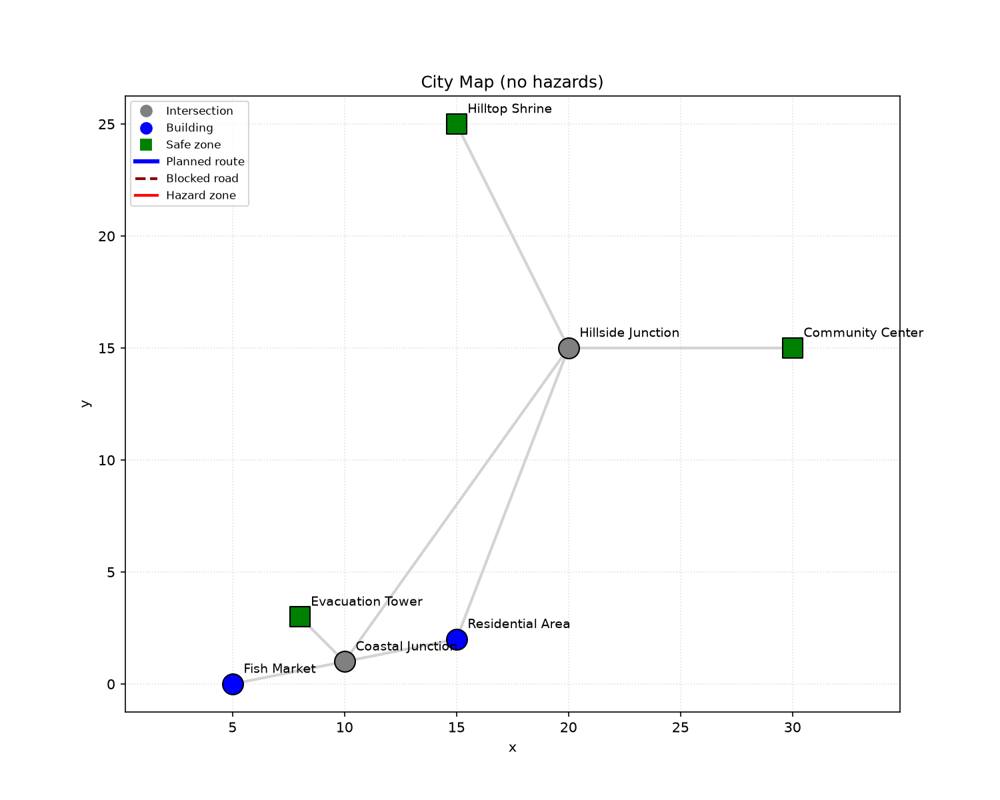
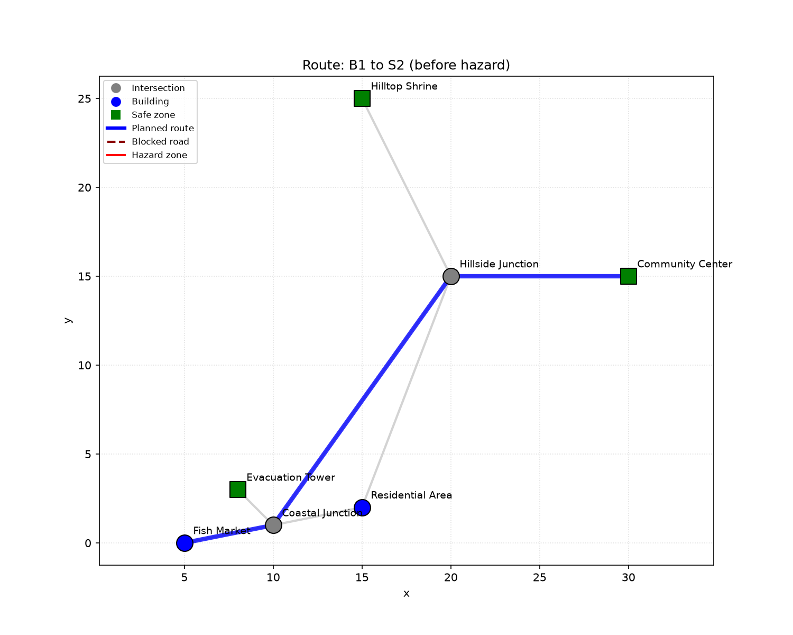
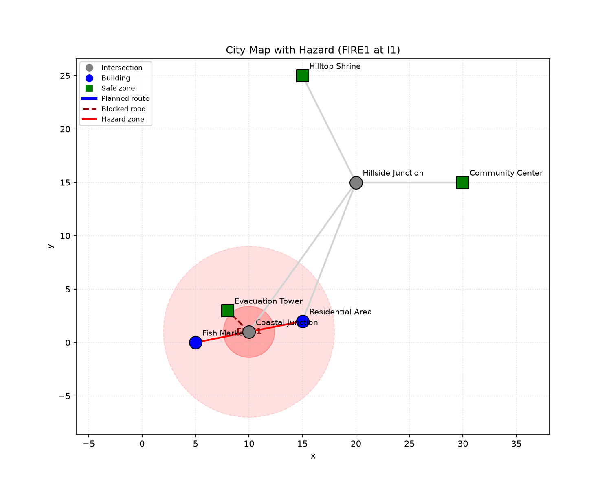
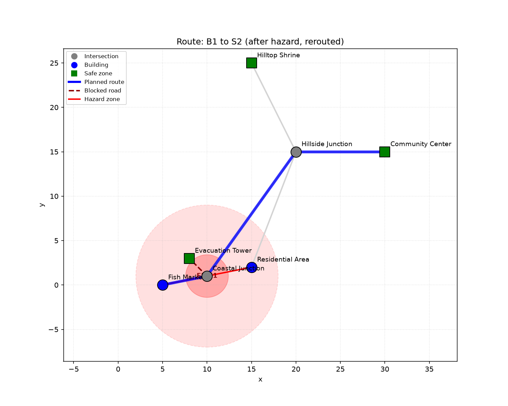

# Evacuation Route Simulator
A command-line program that plots safe evacuation paths from a small city map, reroutes people around active dangers (such as fires or floods) and simulates moving gangs of people from buildings to the nearest available safe space that has space for them.
I built this for my **CSE1021 (Introduction to Problem Solving / Python)** "Build Your Own Project" submission at VIT Bhopal.
**Author:** Avantika Tripathi (26BAI10170)
**Course:** B.Tech CSE (AI & ML)
**Faculty:** J. Manikandan
---

## Why this project
The number one disaster killer I watched over and over again in all the disaster-management videos was: Not knowing which way is safe to go in an emergency. That stuck in my mind and I didn't want to make another To Do list or calculator type project, I wanted something that had some real logic behind it — pathfinding, not just data entry.
The concept: represent a small urban area as a graph consisting of buildings, road intersections, and safe areas.

## What it actually does

The whole thing runs in main_program.py . Once you run it, you can:

1. **View the map** — see every location (buildings, junctions, safe zones) and any hazards currently active.
2. **Set a hazard** — pick a location, give it a radius and a severity (0 to 1). Anything close to the center gets fully blocked; anything further out just gets riskier/slower.
3. **Remove a hazard** — clears it and recalculates the road costs from scratch.
4. **Find a route** — Dijkstra's algorithm finds the nearest safe zone with free space if you don't specify a destination. It also saves a map image of that route.
5. **Run an evacuation simulation** — give it a list of buildings and how many people are in each, and it'll route every group to the nearest safe zone that still has capacity, updating that zone's load as it goes.
6. **Save a picture of the map** — a matplotlib plot showing every road, hazard zone, and location, color-coded by hazard level.
7. **Export the last simulation to CSV** — who went where, how many people, and the route they took.

## Project structure

Evacuation Route Simulator/
├── main_program.py                     # CLI menu, ties everything together
├── sample_outputs.py  # scripted demo — produces the images in /output
├── requirements.txt
├── data/
│   └── map.json                 # the city map: nodes + edges
├── src/
│   ├── graph.py                 # builds the graph from map.json, adjacency lookups
│   ├── pathfinder.py             # Dijkstra + nearest-safe-zone search
│   ├── hazards.py                 # adding/removing hazards, recalculating edge costs
│   ├── simulation.py               # bulk evacuation logic across multiple groups
│   ├── storage.py                    # loading the map, writing the results CSV
│   └── visualizer.py                  # matplotlib rendering of the map/route/hazards
├── tests/
│   └── test_basic.py            # sanity check on the graph + Dijkstra logic
├── docs/                        # architecture, workflow, use case, class & sequence diagrams
└── output/                      # sample maps + CSV generated by sample_outputs.py

## Functional modules :

- **Graph & map module** (`graph.py`, `storage.py`, `data/map.json`) — loading and representing the city as nodes/edges.
- **Routing & hazard module** (`pathfinder.py`, `hazards.py`) — Dijkstra's algorithm plus dynamic hazard-based cost recalculation.
- **Simulation & reporting module** (`simulation.py`, `visualizer.py`) — bulk evacuation across multiple source buildings, plus visual + CSV output.

## Tech / tools used :

- **Python 3.14** (no OOP frameworks — everything's written with plain functions and dictionaries, on purpose, since that's what we'd covered in class at the time)
- **matplotlib** for the map rendering
- **heapq** (standard library) for the Dijkstra priority queue
- **csv / json** (standard library) for I/O
- **Git** for version control

## How the "safety cost" works

Every road (edge) has a base distance. On top of that:

- If a hazard's *severity radius* touches the midpoint of a road, that road's hazard level goes up (closer to the center = higher).
- If a hazard's *critical radius* (30% of the full radius) touches it, the road is marked as fully blocked and Dijkstra will never use it.
- The actual cost used for pathfinding is `distance * (1 + 5 * hazard_level)`, so a road right at the edge of a hazard is a little slower, and a road deep inside one is heavily penalized — but only a *fully blocked* road is completely excluded.

This is why the "before hazard" and "after hazard" screenshots below show two different routes for the same start/end pair.

## Getting it running

# 1. clone the repo
git clone https://github.com/<your-username>/evacuation-route-simulator.git
cd evacuation-route-simulator

# 2. install dependencies
pip install -r requirements.txt

# 3. run it
python main_program.py
You'll get a menu — just type the number of what you want to do and follow the prompts. Example flow:

```
Pick an option: 4
Start node: B1
Destination node (leave blank for nearest safe zone):
Route found (3 stops, cost 13.0):
  B1 -> I1 -> S1
map saved to output/route.png
```

To regenerate all the sample screenshots used in this README/report in one go:

```bash
python sample_outputs.py
```

## Testing

There's a basic sanity test in `tests/test_basic.py` that builds a tiny 3-node graph and checks that:
- Dijkstra picks the shortest path when nothing is blocked.
- It reroutes when the shortest edge is blocked.
- 
Run it with:
```bash
python tests/test_basic.py
```
It prints `all tests passed`.

## Sample output

**City map with no hazards:**



**Route before a hazard (B1 → S2):**



**Same map after a fire hazard shows up near the Coastal Junction:**



**Route after the hazard**



Simulation output (`output/5_simulation_results.csv`) for 150 people at the Fish Market and 400 at the Residential Area, run right after the hazard above:

| source | safe_zone | people | route |
|---|---|---|---|
| B2 | S2 | 400 | B2 -> I2 -> S2 |
| B1 | S2 | 100 | B1 -> I1 -> I2 -> S2 |

(Only 100 of the 150 people from B1 got routed to S2 in this run — worth double-checking against the Evacuation Tower's (S1) remaining capacity if you rerun this with different numbers; capacity limits are enforced per safe zone.)

## Known limitations / things I'd improve with more time

- The map is compacted to one small JSON file.
- No persistence between runs — hazards and safe-zone loads reset every time you restart `main_program.py`.
- Only Dijkstra is implemented. 

## Future enhancements

- Load bigger, real city maps.
- A* search using the existing x/y coordinates to speed up output.
- A simple web front-end instead of a CLI, so multiple people could view the same evacuation state at once.
- Save simulation/hazard history to a small local database instead of losing state on exit.
